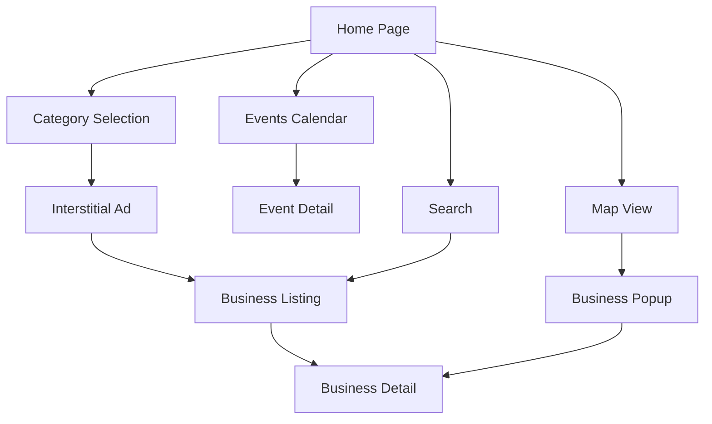

# 🌍 Multi-Location Lifestyle Directory Platform

A scalable Progressive Web App (PWA) platform that can be easily deployed for any geographic market. Originally designed for affluent Bloomfield Hills, Michigan, this modular system allows you to create curated lifestyle guides for any location while maintaining consistent functionality and user experience.

## 🎯 Platform Overview

This **Multi-Location Lifestyle Directory** is designed for maximum scalability and easy adaptation:

### 🏗️ **Scalable Architecture**
- **Location-Based Configuration System**: Easy deployment for new markets
- **Modular Branding & Theming**: Dynamic visual identity per location
- **Flexible Business Categories**: Adaptable to any market type
- **Multi-Environment Deployment**: Staging and production ready

### 🚀 **Core Platform Features**
- **Curated Business Directory**: Flexible categorization for any market
- **Multi-Tier System**: Configurable business classification levels
- **Interactive Mapping**: Leaflet-based mapping with custom markers
- **Events Calendar**: Sophisticated event management system
- **Mobile-Optimized PWA**: Complete mobile optimization with app store readiness
- **Offline Capability**: Full PWA functionality with intelligent caching

### 🌟 **Easy Market Adaptation**
- **One-Command Deployment**: Deploy to new locations with simple scripts
- **Location-Specific Theming**: Automatic branding application
- **Market-Flexible Categories**: Business types adapt to local markets
- **Geographic Customization**: Maps, timezones, and local preferences

---

## 🚀 Key Features

### Business Discovery
- **Signature Businesses**: Premium featured establishments with hero sections
- **Premier Listings**: High-quality businesses with enhanced visibility
- **Curated Directory**: Vetted businesses organized by luxury categories
- **Interactive Search**: Real-time filtering with location-based results
- **Category Navigation**: Fine Dining, Private Clubs, Wellness & Spa, Luxury Real Estate, etc.

### User Experience
- **Mobile-First Design**: Optimized for luxury mobile experience
- **Touch Gestures**: Swipe navigation, pull-to-refresh, edge gestures
- **Offline Functionality**: Works without internet connection
- **App Store Ready**: Can be distributed via iOS App Store and Google Play

### Event Management
- **Signature Events**: Premier event showcase with hero sections
- **Featured Events**: Curated event highlights
- **Interactive Calendar**: Monthly calendar with event selection
- **Event Details**: Comprehensive event information with RSVP capabilities

### Technical Excellence
- **Performance Monitoring**: Real-time Core Web Vitals tracking
- **Progressive Web App**: Full PWA with service worker and caching
- **Responsive Design**: Mobile-first with tablet and desktop optimization
- **Accessibility**: Touch-friendly interface meeting WCAG guidelines

---

## 🛠️ Technology Stack

### Frontend Framework
- **Vue 3** - Composition API with `<script setup>` syntax
- **Vite 4** - Lightning-fast build tool with HMR
- **Vue Router 4** - Client-side routing with history mode

### State Management & Data
- **Pinia** - Modern state management for Vue
- **Reactive Stores**: Business, Events, and Location data management
- **JSON Data Files**: Structured data for businesses and events

### UI & Styling
- **Custom CSS Framework**: FLOZ design system with CSS variables
- **Mobile-First Responsive**: Breakpoints from 320px to 1536px
- **Component Architecture**: Modular, reusable UI components
- **Touch Optimization**: 44px+ touch targets, gesture support

### Maps & Location
- **Leaflet** - Open-source mapping library (no API key required)
- **Custom Markers**: Luxury gold markers with business popups
- **Location Services**: GPS integration with distance calculations
- **Interactive Features**: Zoom, pan, marker clustering

### PWA & Performance
- **Vite PWA Plugin** - Service worker and manifest generation
- **Workbox** - Advanced caching strategies
- **Performance Monitoring** - Core Web Vitals tracking
- **Code Splitting** - Optimized bundle loading

### Mobile Optimization
- **Touch Gestures** - Comprehensive gesture handling
- **App Icons** - Complete iOS and Android icon sets
- **Splash Screens** - Device-specific launch screens
- **Keyboard Handling** - Smart mobile keyboard management

---

## 🚀 Quick Start - Deploy to Any Location

### Deploy Existing Location (Bloomfield Hills)
```bash
# Clone and setup
git clone <repository-url>
cd multi-location-lifestyle-directory
npm install

# Deploy to production
npm run deploy:bloomfield-hills

# Deploy to staging
npm run deploy:bloomfield-hills:staging
```

### Deploy New Location
```bash
# 1. Configure new location in src/config/locations.js
# 2. Deploy with one command
npm run deploy:location your_location_name production

# Example for new city
npm run deploy:location miami_beach production
npm run deploy:location aspen production
npm run deploy:location hamptons production
```

### Development Setup
```bash
# Install dependencies
npm install

# Start development server
npm run dev

# Validate location configuration
npm run validate:location bloomfield_hills
```

### Available Deployment Scripts
```bash
# Location Deployment
npm run deploy:location <location_id> <environment>
npm run deploy:bloomfield-hills         # Production deployment
npm run deploy:bloomfield-hills:staging # Staging deployment
npm run deploy:new-location             # Template deployment

# Development & Maintenance
npm run dev                            # Development server with HMR
npm run build                          # Production build
npm run validate:location <location>   # Validate location config
npm run setup:location <location>      # Setup new location
npm run clean                          # Clean build artifacts
npm run reset                          # Full reset and reinstall
```

---

## 📁 Project Structure

```
FLOZ copy 2/
├── 📁 public/                    # Static assets
│   ├── 📄 app-icon.svg          # Master icon template
│   ├── 📄 favicon.ico           # Browser favicon
│   ├── 📄 pwa-*.png            # PWA icons (various sizes)
│   └── 📄 APP_ICONS_README.md  # Icon generation guide
│
├── 📁 scripts/                  # Build and utility scripts
│   └── 📄 generate-icons.js     # Automated icon generation
│
├── 📁 src/                      # Source code
│   ├── 📁 assets/              # Application assets
│   │   ├── 📁 styles/          # FLOZ CSS Framework
│   │   │   ├── 📄 main.css     # Main stylesheet (imports all)
│   │   │   ├── 📄 variables.css # CSS custom properties
│   │   │   ├── 📄 base.css     # Reset and base styles
│   │   │   ├── 📄 utilities.css # Utility classes
│   │   │   ├── 📄 mobile-performance.css # Mobile optimizations
│   │   │   ├── 📁 components/  # Component styles
│   │   │   │   ├── 📄 buttons.css      # Button variants
│   │   │   │   ├── 📄 cards.css        # Card components
│   │   │   │   ├── 📄 forms.css        # Form elements
│   │   │   │   ├── 📄 modals.css       # Modal dialogs
│   │   │   │   └── 📄 navigation.css   # Navigation components
│   │   │   ├── 📁 layout/      # Layout styles
│   │   │   │   ├── 📄 grid.css         # Grid systems
│   │   │   │   └── 📄 containers.css   # Container layouts
│   │   │   └── 📁 pages/       # Page-specific styles
│   │   │       ├── 📄 home.css                 # Home page
│   │   │       ├── 📄 category-listing.css     # Business listings
│   │   │       ├── 📄 category-interstitial.css # Ad interstitials
│   │   │       ├── 📄 subcategory-listing.css  # Subcategory pages
│   │   │       └── 📄 contact.css              # Contact pages
│   │   └── 📁 data/            # Static data files
│   │       ├── 📄 businesses.json      # Business directory data
│   │       ├── 📄 events.json          # Events calendar data
│   │       └── 📄 categories.json      # Category definitions
│   │
│   ├── 📁 components/          # Vue components
│   │   ├── 📁 Business/        # Business-related components
│   │   │   ├── 📄 BusinessCard.vue     # Business listing cards
│   │   │   ├── 📄 BusinessModal.vue    # Business detail modal
│   │   │   └── 📄 BusinessList.vue     # Business list containers
│   │   ├── 📁 Events/          # Event components
│   │   │   ├── 📄 EventCard.vue        # Event listing cards
│   │   │   ├── 📄 EventModal.vue       # Event detail modal
│   │   │   └── 📄 EventCalendar.vue    # Interactive calendar
│   │   ├── 📁 Navigation/      # Navigation components
│   │   │   ├── 📄 TopBar.vue           # Header navigation
│   │   │   ├── 📄 BottomNav.vue        # Bottom tab navigation
│   │   │   └── 📄 SideMenu.vue         # Hamburger side menu
│   │   ├── 📁 UI/              # Reusable UI components
│   │   │   ├── 📄 BaseModal.vue        # Modal base component
│   │   │   ├── 📄 LoadingSpinner.vue   # Loading indicators
│   │   │   └── 📄 QRCodeModal.vue      # QR code sharing
│   │   └── 📁 Map/             # Map components
│   │       ├── 📄 InteractiveMap.vue   # Leaflet map wrapper
│   │       └── 📄 MapControls.vue      # Map control buttons
│   │
│   ├── 📁 stores/              # Pinia state stores
│   │   ├── 📄 businessStore.js         # Business data and search
│   │   ├── 📄 eventsStore.js          # Events and calendar data
│   │   └── 📄 locationStore.js        # User location and map state
│   │
│   ├── 📁 utils/               # Utility functions
│   │   ├── 📄 performance.js          # Performance monitoring
│   │   ├── 📄 gestures.js            # Mobile gesture handling
│   │   └── 📄 icons.js               # SVG icon definitions
│   │
│   ├── 📁 views/               # Page components (Vue Router)
│   │   ├── 📄 HomeView.vue            # Landing page
│   │   ├── 📄 CategoryListingView.vue # Business category pages
│   │   ├── 📄 CategoryInterstitialView.vue # Advertisement interstitials
│   │   ├── 📄 EventsView.vue          # Events calendar page
│   │   ├── 📄 BusinessDetailView.vue  # Individual business pages
│   │   ├── 📄 ContactView.vue         # Contact information
│   │   └── 📄 MapView.vue            # Full-screen map view
│   │
│   ├── 📄 App.vue              # Root application component
│   ├── 📄 main.js              # Application entry point
│   └── 📄 router.js            # Vue Router configuration
│
├── 📄 index.html               # HTML template with PWA meta tags
├── 📄 vite.config.js          # Vite configuration with PWA setup
├── 📄 package.json            # Dependencies and scripts
├── 📄 MOBILE_OPTIMIZATION_SUMMARY.md # Complete mobile optimization guide
└── 📄 README.md               # This documentation
```

---

## 🏗️ Architecture Overview

### Application Flow


### Component Hierarchy
```
App.vue
├── TopBar.vue (Header navigation)
├── Router View (Page content)
│   ├── HomeView.vue
│   ├── CategoryListingView.vue
│   ├── EventsView.vue
│   └── MapView.vue
└── BottomNav.vue (Tab navigation)
```

### State Management (Pinia)
- **businessStore**: Business data, search, filtering, ads
- **eventsStore**: Events data, calendar state, featured events
- **locationStore**: User location, map state, coordinates

---

## 🎨 FLOZ CSS Framework

The Hills Guide uses a custom CSS framework built specifically for luxury mobile experiences.

### Design System
```css
/* CSS Variables Architecture */
:root {
  /* Brand Colors - Luxury Gold & Black */
  --color-primary: #D4AF37;        /* Elegant gold */
  --color-bg-primary: #0A0A0A;     /* Rich black */

  /* Touch Targets - Mobile Optimized */
  --touch-target-min: 44px;        /* iOS minimum */
  --touch-target-recommended: 48px; /* Recommended size */

  /* Typography - Luxury Fonts */
  --font-family-heading: 'Playfair Display', serif;
  --font-family-luxury: 'Cormorant Garamond', serif;
}
```

### Component Classes
- **Buttons**: `.btn`, `.btn-primary`, `.btn-secondary`, with mobile touch optimization
- **Cards**: `.category-card`, `.business-card`, with tier-based styling
- **Navigation**: `.top-bar`, `.bottom-nav`, `.side-menu` with gesture support
- **Modals**: `.base-modal` with consistent luxury styling

### Mobile-First Responsive
```css
/* Base Mobile: 320px+ (Default) */
/* Small Mobile: 375px+ (Enhanced) */
/* Tablet: 640px+ (Expanded) */
/* Desktop: 1024px+ (Full-featured) */
```

---

## 🏢 Business Data Structure

### Business Object Schema
```javascript
{
  id: Number,                    // Unique identifier
  name: String,                  // Business name
  category: String,              // Primary category
  subcategory: String,           // Optional subcategory
  listing_tier: String,          // 'signature' | 'premier' | 'curated'

  // Contact Information
  phone: String,                 // Phone number
  website: String,               // Website URL
  email: String,                 // Email address

  // Location Data
  address: String,               // Full address
  latitude: Number,              // GPS coordinates
  longitude: Number,             // GPS coordinates

  // Content
  description: String,           // Business description
  heroImage: String,             // Featured image URL
  logo: String,                  // Logo image URL

  // Features
  hours: Object,                 // Operating hours by day
  badges: Array,                 // Special badges ['On The Water', etc.]
  amenities: Array,              // Available amenities

  // Advertisement Data
  ads: {
    hero: Object,                // Hero banner ads
    inline: Array,               // Inline advertisement units
    interstitial: Object         // Full-screen interstitial ads
  }
}
```

### Business Tiers
1. **Signature** - Premium businesses with hero sections and exclusive features
2. **Premier** - High-quality businesses with enhanced visibility
3. **Curated** - Vetted businesses in standard listings

---

## 📅 Events System

### Event Object Schema
```javascript
{
  id: Number,                    // Unique identifier
  title: String,                 // Event name
  date: String,                  // ISO date string
  time: String,                  // Event time
  venue: String,                 // Venue name
  address: String,               // Venue address
  description: String,           // Event description
  image: String,                 // Event image URL
  category: String,              // Event category
  tier: String,                  // 'signature' | 'featured' | 'standard'
  ticketUrl: String,             // Ticket purchase URL
  featured: Boolean              // Featured event flag
}
```

### Calendar Features
- **Monthly Navigation**: Interactive calendar with event indicators
- **Event Filtering**: Filter by date, category, and tier
- **Signature Events**: Premium event showcase
- **Featured Events**: Horizontal scrolling featured section

---

## 🗺️ Map Integration

### Leaflet Configuration
```javascript
// Map centered on Bloomfield Hills, Michigan
const BLOOMFIELD_HILLS_CENTER = {
  lat: 42.5831,
  lng: -83.2455
}

// Custom gold markers for luxury branding
const goldMarker = L.divIcon({
  className: 'custom-gold-marker',
  html: '<div class="marker-gold">📍</div>'
})
```

### Map Features
- **Interactive Markers**: Click to view business popup
- **Search Integration**: Real-time filtering of visible markers
- **Custom Styling**: Luxury gold markers matching brand
- **User Location**: GPS integration with distance calculation
- **Responsive**: Mobile-optimized touch controls

---

## 📱 Mobile Optimization

### PWA Features
- **Service Worker**: Intelligent caching with Workbox
- **App Manifest**: Complete PWA configuration
- **Install Prompts**: Native app installation experience
- **Offline Support**: Full functionality without internet
- **Push Notifications**: Ready for future implementation

### Performance Optimizations
- **Core Web Vitals**: Real-time LCP, FID, CLS monitoring
- **Code Splitting**: Vendor, maps, and UI chunks
- **Image Optimization**: Lazy loading with intersection observer
- **Touch Optimization**: 44px+ touch targets, no tap delays
- **Bundle Size**: Optimized for mobile networks

### Touch Gestures
- **Swipe Navigation**: Edge swipe to go back (iOS-style)
- **Pull-to-Refresh**: Native-feeling refresh gestures
- **Long Press**: Context menus and actions
- **Keyboard Handling**: Smart mobile keyboard management

---

## 🔧 Development Guidelines

### Component Development
```vue
<template>
  <!-- Always use semantic HTML -->
  <article class="business-card" :class="tierClass">
    <!-- Component content -->
  </article>
</template>

<script setup>
// Use Composition API with script setup
import { computed, ref } from 'vue'

// Props with TypeScript-like definitions
const props = defineProps({
  business: {
    type: Object,
    required: true
  },
  tier: {
    type: String,
    default: 'curated'
  }
})

// Reactive data
const isExpanded = ref(false)

// Computed properties
const tierClass = computed(() => `tier-${props.tier}`)

// Methods
const handleClick = () => {
  // Handle user interaction
}
</script>

<style scoped>
/* Component-specific styles using CSS variables */
.business-card {
  /* Use design system variables */
  padding: var(--space-4);
  border-radius: var(--radius-lg);
  background: var(--color-bg-secondary);
}
</style>
```

### CSS Guidelines
```css
/* Use CSS custom properties for consistency */
.component {
  /* Spacing: Use 8px grid system */
  padding: var(--space-4);           /* 16px */
  margin: var(--space-3);            /* 12px */

  /* Colors: Use semantic color names */
  background: var(--color-bg-secondary);
  color: var(--color-text-primary);

  /* Touch targets: Minimum 44px */
  min-height: var(--touch-target-min);

  /* Transitions: Use consistent timing */
  transition: var(--transition-base);
}

/* Mobile-first responsive design */
@media (min-width: 640px) {
  .component {
    /* Tablet and desktop enhancements */
  }
}
```

### State Management Patterns
```javascript
// stores/exampleStore.js
import { defineStore } from 'pinia'
import { ref, computed } from 'vue'

export const useExampleStore = defineStore('example', () => {
  // State (reactive data)
  const items = ref([])
  const loading = ref(false)

  // Getters (computed properties)
  const filteredItems = computed(() => {
    return items.value.filter(item => item.active)
  })

  // Actions (methods)
  const loadItems = async () => {
    loading.value = true
    try {
      // Fetch data
      const data = await fetchItems()
      items.value = data
    } catch (error) {
      console.error('Failed to load items:', error)
    } finally {
      loading.value = false
    }
  }

  return {
    // Expose state, getters, and actions
    items,
    loading,
    filteredItems,
    loadItems
  }
})
```

---

## 🚀 Deployment

### Build Process
```bash
# Production build with optimizations
npm run build

# Generated files in dist/
dist/
├── index.html              # Entry point with PWA meta tags
├── assets/
│   ├── index-[hash].js     # Main application bundle
│   ├── vendor-[hash].js    # Third-party libraries
│   ├── maps-[hash].js      # Leaflet mapping code
│   └── index-[hash].css    # Compiled styles
├── pwa-*.png              # PWA icons
├── sw.js                  # Service worker
└── workbox-*.js           # Workbox runtime
```

### PWA Deployment
The application is configured as a Progressive Web App and can be:
- **Hosted on any web server** (Netlify, Vercel, AWS S3, etc.)
- **Submitted to app stores** using PWABuilder or Bubblewrap
- **Installed natively** on iOS and Android devices

### Environment Configuration
```javascript
// vite.config.js - Production optimizations
export default defineConfig({
  build: {
    target: ['es2015', 'chrome58', 'firefox57', 'safari11'],
    cssCodeSplit: true,
    sourcemap: false,
    minify: 'terser'
  }
})
```

---

## 🔍 Debugging & Development

### Performance Monitoring
```javascript
// Access performance data in components
export default {
  mounted() {
    // Performance monitor available globally
    const metrics = this.$performance.getMetrics()
    console.log('Core Web Vitals:', metrics)
  }
}
```

### Development Tools
- **Vue DevTools**: Component inspection and state debugging
- **Vite HMR**: Hot module replacement for instant updates
- **Performance Monitor**: Real-time Core Web Vitals in console
- **Network Tab**: Monitor PWA caching and offline behavior

### Common Issues
1. **Service Worker Updates**: Clear cache for PWA updates
2. **Touch Targets**: Ensure minimum 44px for accessibility
3. **Image Loading**: Use lazy loading for performance
4. **Mobile Testing**: Test on actual devices for gesture accuracy

---

## 🤝 Contributing

### Code Standards
- **Vue 3 Composition API**: Use `<script setup>` syntax
- **Mobile-First**: Design for mobile, enhance for desktop
- **Accessibility**: Minimum 44px touch targets, semantic HTML
- **Performance**: Monitor Core Web Vitals, optimize images
- **Consistency**: Use FLOZ CSS framework variables

### Development Workflow
1. **Branch**: Create feature branch from main
2. **Develop**: Follow component and CSS guidelines
3. **Test**: Verify on mobile devices and different screen sizes
4. **Performance**: Check Core Web Vitals impact
5. **Review**: Ensure code follows established patterns

---

## 📞 Support & Documentation

### Additional Resources
- **Mobile Optimization Guide**: `MOBILE_OPTIMIZATION_SUMMARY.md`
- **Icon Generation**: `public/APP_ICONS_README.md`
- **Component Examples**: Browse `src/components/` directory
- **CSS Framework**: Explore `src/assets/styles/` for patterns

### Performance Targets
- **First Contentful Paint**: < 1.8 seconds
- **Largest Contentful Paint**: < 2.5 seconds
- **First Input Delay**: < 100 milliseconds
- **Cumulative Layout Shift**: < 0.1

### Browser Support
- **iOS Safari**: 11+
- **Chrome Mobile**: 58+
- **Firefox Mobile**: 57+
- **Samsung Internet**: 8+
- **Desktop**: All modern browsers

---

**The Hills Guide** - Sophisticated luxury lifestyle directory for discerning Bloomfield Hills residents. Built with modern web technologies, mobile-first design, and app store readiness.

*For technical questions or contributions, please refer to the component documentation and established code patterns throughout the application.*