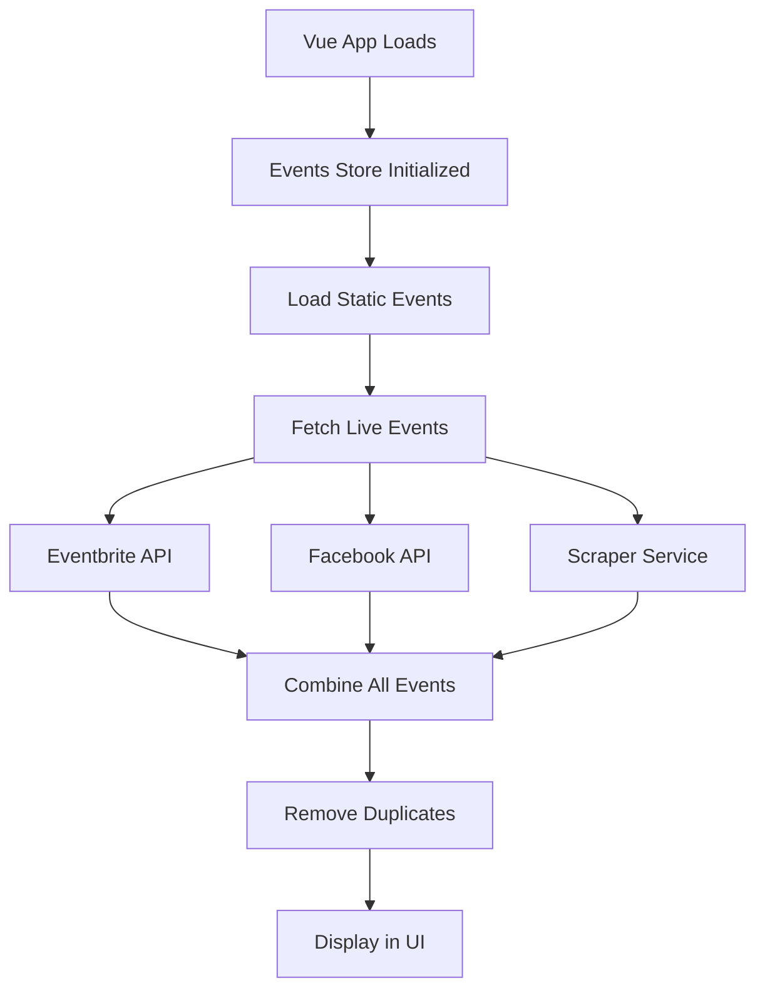

# Event Automation Guide

This guide explains how to set up automated event fetching for the FLOZ app to eliminate manual data entry.

## Overview

The FLOZ app now includes a comprehensive automated event fetching system that can pull live events from multiple sources:

1. **Eventbrite API** - Fetch events from Eventbrite in the Lake of the Ozarks area
2. **Facebook Events API** - Get events from popular venue Facebook pages
3. **Web Scraping Service** - Scrape events directly from venue websites

## Quick Start

### 1. Basic Setup (Manual Events Only)

The app works immediately with static event data. No additional setup is required for basic functionality.

### 2. API Integration Setup

#### A. Eventbrite Integration

1. **Get API Key:**
   - Go to [https://www.eventbrite.com/platform/api-keys](https://www.eventbrite.com/platform/api-keys)
   - Create an Eventbrite account if needed
   - Generate a new API key

2. **Configure Environment:**
   ```bash
   # Copy the example environment file
   cp .env.example .env

   # Edit .env and add your Eventbrite API key
   VITE_EVENTBRITE_API_KEY=your_actual_api_key_here
   ```

3. **Test Integration:**
   - Restart your development server: `npm run dev`
   - Check browser console for Eventbrite fetch logs
   - Events should appear in the Events page automatically

#### B. Facebook Events Integration

⚠️ **Note:** Facebook Events API requires app review for production use.

1. **Create Facebook App:**
   - Go to [https://developers.facebook.com/](https://developers.facebook.com/)
   - Create a new Facebook App
   - Add "Events" permissions to your app

2. **Get Access Tokens:**
   - Generate page access tokens for venue Facebook pages
   - Popular Lake of the Ozarks venues included:
     - Margaritaville Lake Resort
     - Backwater Jack's
     - Shady Gators
     - Captain Ron's Bar & Grill

3. **Configure Environment:**
   ```bash
   # Add to your .env file
   VITE_FACEBOOK_ACCESS_TOKEN=your_facebook_access_token_here
   ```

#### C. Web Scraping Service

The web scraping service runs as a separate Node.js backend to avoid CORS restrictions.

1. **Install Dependencies:**
   ```bash
   # Install required packages for the scraper service
   npm install axios cheerio express cors
   ```

2. **Start Scraper Service:**
   ```bash
   # Run the scraper service on port 3001
   node server/eventScraper.js
   ```

3. **Configure Environment (Optional):**
   ```bash
   # Add to .env if using custom scraper service URL
   VITE_SCRAPER_SERVICE_URL=http://localhost:3001
   ```

## How It Works

### Data Flow



### Event Data Sources Priority

1. **Static Events** - Always loaded first (manually curated events)
2. **External APIs** - Fetched in parallel:
   - Eventbrite (if API key configured)
   - Facebook (if access token configured)
   - Scraped venues (if scraper service running)
3. **Deduplication** - Removes duplicate events based on title, date, and location
4. **Categorization** - Automatically categorizes events using keywords

### Error Handling

The system gracefully handles API failures:
- If Eventbrite API fails → App continues with other sources
- If Facebook API fails → App continues with other sources
- If scraper service is down → App uses mock scraped data
- If all external sources fail → App works with static events only

## Event Categories

Events are automatically categorized using keyword detection:

- **Concert** - music, band, singer, jazz, rock, country
- **Festival** - festival, fest, celebration
- **Food & Wine** - wine, food, tasting, dining, restaurant
- **Comedy** - comedy, comedian, stand-up, funny
- **Sports** - race, tournament, game, sport
- **Entertainment** - show, performance, theater, entertainment

## Customization

### Adding New Venues

#### For Web Scraping

1. **Edit `server/eventScraper.js`:**
   ```javascript
   // Add new scraping function
   async function scrapeNewVenueEvents() {
     try {
       const response = await axios.get('https://newvenue.com/events');
       const $ = cheerio.load(response.data);

       // Parse venue-specific HTML structure
       // Return events in standardized format
     } catch (error) {
       console.error('Error scraping new venue:', error);
       return [];
     }
   }

   // Add to main scraping endpoint
   app.get('/api/scraped-events', async (req, res) => {
     const newVenueEvents = await scrapeNewVenueEvents();
     allEvents.push(...newVenueEvents);
     // ... rest of function
   });
   ```

#### For Facebook Integration

1. **Add venue Facebook page ID to `eventsStore.js`:**
   ```javascript
   const venuePages = [
     'MargaritavilleLakeOzarks',
     'BackwaterJacks',
     'ShadyGators',
     'CaptainRonsBarGrill',
     'NewVenuePageId'  // Add new venue here
   ];
   ```

### Modifying Event Categories

Edit the `categorizeEvent` function in `eventsStore.js`:

```javascript
categorizeEvent(text) {
  const keywords = {
    'Your New Category': ['keyword1', 'keyword2'],
    // ... existing categories
  };
  // ... rest of function
}
```

## Troubleshooting

### Common Issues

#### 1. No External Events Loading

**Check Console Logs:**
- Look for API key warnings in browser console
- Verify environment variables are set correctly

**Test APIs Individually:**
```bash
# Test Eventbrite API
curl -H "Authorization: Bearer YOUR_API_KEY" \
  "https://www.eventbriteapi.com/v3/events/search/?location.address=Lake+of+the+Ozarks,+MO"

# Test Facebook API
curl "https://graph.facebook.com/v18.0/MargaritavilleLakeOzarks/events?access_token=YOUR_TOKEN"
```

#### 2. Scraper Service Not Working

**Check Service Status:**
```bash
# Make sure scraper service is running
curl http://localhost:3001/health

# Check scraped events endpoint
curl http://localhost:3001/api/scraped-events
```

**Common Fixes:**
- Ensure Node.js dependencies are installed
- Check port 3001 is not in use by another service
- Verify CORS configuration allows your Vue app domain

#### 3. Events Not Displaying

**Debug Steps:**
1. Check browser console for JavaScript errors
2. Verify events store is loading data: `eventsStore.events`
3. Check event date formats are valid
4. Ensure event categories match expected values

### API Rate Limits

- **Eventbrite**: 1000 requests per hour per API key
- **Facebook**: Varies by app review status and permissions
- **Web Scraping**: Implement delays between requests to be respectful

## Production Deployment

### Environment Variables

Set these on your hosting platform:

```bash
VITE_EVENTBRITE_API_KEY=your_production_eventbrite_key
VITE_FACEBOOK_ACCESS_TOKEN=your_production_facebook_token
VITE_SCRAPER_SERVICE_URL=https://your-scraper-service.com
```

### Security Considerations

1. **API Keys**: Never commit real API keys to version control
2. **CORS**: Configure proper CORS settings for production domains
3. **Rate Limiting**: Implement rate limiting for scraper service
4. **Error Monitoring**: Set up error tracking for API failures

### Hosting Options

#### Vue App
- **Netlify** - Automatic deployment from Git
- **Vercel** - Serverless deployment with edge functions
- **GitHub Pages** - Free static hosting

#### Scraper Service
- **Railway** - Node.js app hosting with automatic deployments
- **Render** - Free tier available for Node.js services
- **Heroku** - Easy Node.js deployment with add-ons

## Performance Optimization

### Caching Strategy

```javascript
// Implement caching in eventsStore.js
const CACHE_DURATION = 1000 * 60 * 15; // 15 minutes

if (this.lastUpdated && (Date.now() - this.lastUpdated) < CACHE_DURATION) {
  console.log('Using cached events data');
  return;
}
```

### Background Updates

```javascript
// Set up periodic updates
setInterval(async () => {
  await this.refreshEvents();
}, 1000 * 60 * 30); // Update every 30 minutes
```

## Support

For issues with the event automation system:

1. Check this guide first
2. Review browser console for error messages
3. Test individual API endpoints
4. Verify environment configuration
5. Check network connectivity and CORS settings

The system is designed to be fault-tolerant - if external data sources fail, the app will continue working with available data.